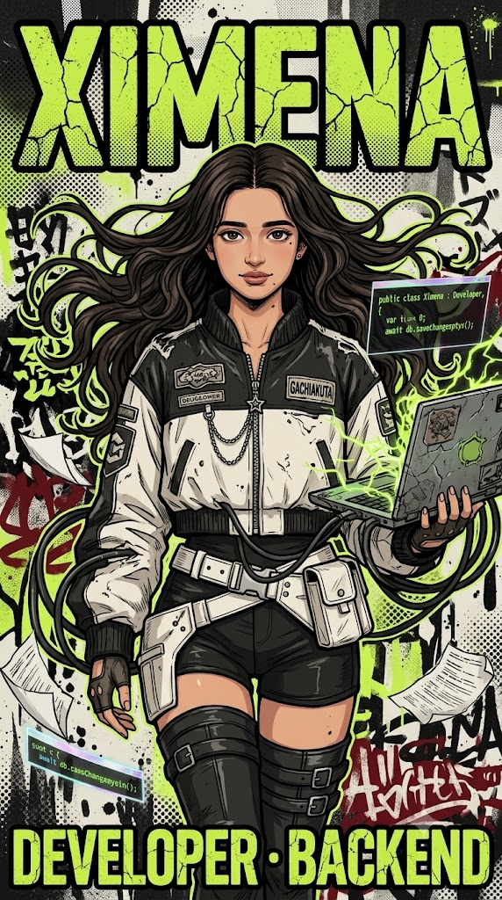

<!-- ═══════════ HEADER ANIMADO EN ROSA ═══════════ -->
<p align="center">
  
</p>

<!-- ═══════════ TYPING ANIMADO ═══════════ -->
<p align="center">
  <a href="https://github.com/Jaramc">
    
  </a>
</p>

<p align="center">
  
  
  
  
</p>

<!-- ═══════════ ICONOS SOCIALES ═══════════ -->
<p align="center">
  <a href="https://www.linkedin.com/in/ximena-jaramillo-cardenas">
    
  </a>
  <a href="https://github.com/Jaramc">
    
  </a>
  <a href="mailto:ximenajaramc@gmail.com">
    
  </a>
  <a href="https://discord.com/app" title="Discord: ximena.jaram_c">
    
  </a>
</p>

<!-- ═══════════ PRESENTACIÓN PERSONAL ═══════════ -->
<table>
  <tr>
    <td width="240" align="center">
      
    </td>
    <td>
      <h3>Hola 👋 Soy Ximena, desarrolladora full stack.</h3>
      <p>
        Trabajo sobre todo en el <b>backend</b> con <b>C# / .NET</b> y bases de datos
        <b>PostgreSQL</b>, y me muevo con soltura en infraestructura:
        <b>Docker, Kubernetes, Azure y RabbitMQ</b>. Ahora mismo soy Tech Lead en
        <b>Cerberus</b> (DevSecOps) y llevo la base de datos y el despliegue en <b>PAWS</b>.
      </p>
      <p>
        Me gusta <b>trabajar en equipo</b>: soy buena comunicándome y socializando,
        disfruto explicar lo que sé y aprender de los demás. Cada proyecto lo tomo como
        una excusa para mejorar un poco más.
      </p>
    </td>
  </tr>
</table>

<!-- ═══════════ PRESENTACIÓN (TERMINAL) ═══════════ -->
```ansi
ximena@github:~$ whoami
[38;2;244;114;182mximena[0m · full stack developer · medellín, co

ximena@github:~$ cat sobre-mi.txt
> Backend con C# / .NET 8-10 y bases de datos PostgreSQL
> Opero infraestructura: k3s · Docker · Azure · RabbitMQ
> Tech Lead en Cerberus (DevSecOps) · BD y despliegue en PAWS
> Scrum, liderazgo y aprendizaje constante
```

---

```console
ximena@github:~$ ls -la ./stack

drwxr-xr-x   ximena   dev    frontend/
drwxr-xr-x   ximena   dev    backend/
drwxr-xr-x   ximena   dev    databases/
drwxr-xr-x   ximena   dev    devops/
```

<table>
  <tr>
    <td><code>frontend/</code></td>
    <td></td>
  </tr>
  <tr>
    <td><code>backend/</code></td>
    <td>
      <br />
      
      
      
    </td>
  </tr>
  <tr>
    <td><code>databases/</code></td>
    <td></td>
  </tr>
  <tr>
    <td><code>devops/</code></td>
    <td></td>
  </tr>
</table>

---

```console
ximena@github:~$ cat curiosidades.txt

> Musica
> Caminar
> practico artes marciales
> Anime y series 
> Ir al cine
> piscinas, playas o charcos: si hay agua, yo me lanzo
```

<table>
  <tr>
    <td></td>
    <td>Playlist en loop mientras el proyecto compila.</td>
  </tr>
  <tr>
    <td></td>
    <td>Largas distancias a pie: mi mejor herramienta de debugging.</td>
  </tr>
  <tr>
    <td></td>
    <td>Entrenar constancia, no solo golpes.</td>
  </tr>
  <tr>
    <td></td>
    <td>Fan del manga <b>Gachiakuta</b> — de ahí sale la estética de este perfil.</td>
  </tr>
  <tr>
    <td></td>
    <td>Sala oscura, sin notificaciones, sin excusas.</td>
  </tr>
  <tr>
    <td></td>
    <td>Piscinas, playas y charcos — agua es agua.</td>
  </tr>
</table>

---

```console
ximena@github:~$ ./contributions.sh --user Jaramc --theme dark
```

<div align="center">

  
  

  <br /><br />

  

  <br /><br />

  

</div>

---

```console
ximena@github:~$ ./pacman.sh --eat contributions

[ok] waka waka · consumiendo el grafo de contribuciones...
```

<div align="center">

  <picture>
    <source media="(prefers-color-scheme: dark)" srcset="https://raw.githubusercontent.com/Jaramc/Jaramc/output/pacman-contribution-graph-dark.svg" />
    <source media="(prefers-color-scheme: light)" srcset="https://raw.githubusercontent.com/Jaramc/Jaramc/output/pacman-contribution-graph.svg" />
    
  </picture>

</div>

---

```console
ximena@github:~$ exit
logout · gracias por pasar por la terminal
```

<div align="center">

  <a href="https://www.linkedin.com/in/ximena-jaramillo-cardenas">
    
  </a>
  <a href="mailto:ximenajaramc@gmail.com">
    
  </a>
  <a href="https://github.com/Jaramc">
    
  </a>

</div>
